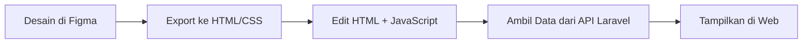

# Dari-Desain-ke-Kode-Integrasi-Figma-Laravel

# Panduan Lengkap: Desain Figma ke Backend (Laravel/React)

**Dokumentasi Teknis** | **Platform: Figma & Web** | **Tanggal: 20 Juni 2026**

---

## 📋 Daftar Isi

- [1. Pendahuluan](#1-pendahuluan)
- [2. Cara 1: Desain Figma → Web Siap Pakai](#2-cara-1-desain-figma--web-siap-pakai)
- [3. Cara 2: Desain Figma → Prototype Interaktif + Backend (Cara Canggih)](#3-cara-2-desain-figma--prototype-interaktif--backend-cara-canggih)
- [4. Rekomendasi untuk Faris](#4-rekomendasi-untuk-faris)
- [5. Langkah Praktis: Ekspor Figma ke HTML + Sambung Laravel](#5-langkah-praktis-ekspor-figma-ke-html--sambung-laravel)
- [6. Ringkasan Alur](#6-ringkasan-alur)

---

## 1. Pendahuluan

### Apa itu Figma?

Figma adalah alat desain antarmuka (UI/UX) berbasis cloud. Digunakan untuk membuat layout website, aplikasi, dan prototype interaktif.

### Mengapa Figma Penting untuk Developer?

| Keuntungan | Keterangan |
|------------|-------------|
| **Kolaborasi Tim** | Desain bisa dilihat dan diedit bareng-bareng |
| **Ekspor Kode** | Bisa menghasilkan CSS, HTML, bahkan React Components |
| **Prototype Interaktif** | Bisa simulasi klik, scroll, animasi |
| **Integrasi Backend** | Bisa dihubungkan ke database lewat Supabase atau API |

---

## 2. Cara 1: Desain Figma → Web Siap Pakai

### Alur Umum

```

Desain di Figma → Export ke HTML/CSS → Integrasi Backend

```

### Langkah-Langkah

| Langkah | Yang Dilakukan | Detail |
|---------|----------------|--------|
| **1** | Desain di Figma | Buat layout web di Figma (halaman login, dashboard, dll) |
| **2** | Export Desain | Gunakan plugin Figma (Siter.io, Sloth D2C, atau Figma to HTML) |
| **3** | Ubah ke Kode | Plugin ubah desain jadi HTML/CSS siap pakai |
| **4** | Sambung Backend | Tulis kode backend sendiri pakai Laravel/Node.js, lalu sambungkan lewat JavaScript |

### Tools Export Figma

| Nama Plugin | Keterangan |
|-------------|-------------|
| **Siter.io** | Export ke website langsung dengan integrasi CMS |
| **Sloth D2C** | Export ke HTML, CSS, React, Vue, atau Svelte |
| **Figma to HTML** | Export desain jadi HTML + CSS sederhana |

---

## 3. Cara 2: Desain Figma → Prototype Interaktif + Backend (Cara Canggih)

### Alur

```

Figma Make → Hubungkan Supabase → Backend Aktif

```

### Langkah-Langkah

| Langkah | Yang Dilakukan | Detail |
|---------|----------------|--------|
| **1** | Buka Figma Make | Fitur AI di Figma untuk bikin prototipe web |
| **2** | Minta Backend | Prompt: "Tambahkan autentikasi" atau "Simpan data ke database" |
| **3** | Konek ke Supabase | Hubungkan akun Supabase ke Figma |
| **4** | Desain + Backend Aktif | Figma Make bikin prototipe fungsional yang bisa collect input user dan simpan data |

### Supabase

Supabase adalah platform **Backend-as-a-Service (BaaS)** yang menyediakan:

| Fitur | Fungsi |
|-------|--------|
| **Database PostgreSQL** | Penyimpanan data utama |
| **Authentication** | Login/Register user |
| **Storage** | Penyimpanan file/gambar |
| **Real-time** | Update data secara langsung |

---

## 4. Rekomendasi untuk Faris

Berdasarkan skill Faris yang sudah punya **Laravel + React**, saran saya:

| Pilihan | Keterangan |
|---------|-------------|
| **Gunakan Cara 1** | Desain di Figma, export ke HTML, sambung ke Laravel sendiri |
| **Figma hanya untuk Desain** | Servernya tetap kamu pegang penuh pakai Laravel |
| **Kode HTML export** | Integrasi dengan JavaScript ke endpoint API `http://127.0.0.1:8000/api/...` |

### Kenapa Cara 1?

| Alasan | Keterangan |
|--------|-------------|
| **Kontrol Penuh** | Kamu tetap megang backend sendiri |
| **Sudah Familiar** | Laravel sudah kamu kuasai dari proyek sebelumnya |
| **Fleksibel** | Bisa kustomisasi API sesuka hati |

---

## 5. Langkah Praktis: Ekspor Figma ke HTML + Sambung Laravel

### Langkah 1: Desain di Figma

Buat desain web sederhana di Figma (misal: halaman login, dashboard, atau tampilan data produk).

### Langkah 2: Ekspor ke HTML

Gunakan salah satu plugin (contoh: **Sloth D2C**) untuk export desain menjadi HTML/CSS.

### Langkah 3: Simpan File HTML

Hasil export biasanya berupa:

```

export-figma/
├── index.html
├── style.css
└── assets/
├── gambar1.png
└── gambar2.png

```

### Langkah 4: Sambung ke Laravel

#### 4.1 Pastikan Backend Jalan

```bash
php artisan serve
```

4.2 Edit File HTML

Tambahkan JavaScript di file index.html untuk ambil data dari Laravel:

```javascript
// Contoh menggunakan fetch API
fetch('http://127.0.0.1:8000/api/nama-model')
    .then(response => response.json())
    .then(data => {
        console.log(data);
        // Tampilkan data ke elemen HTML
        document.getElementById('data-container').innerHTML = 
            data.map(item => `<li>${item.nama_model}</li>`).join('');
    })
    .catch(error => console.error('Error:', error));
```

4.3 Simpan & Buka

Buka file index.html di browser. Data dari Laravel akan muncul di halaman web!

---

6. Ringkasan Alur



Versi Teks

Langkah Keterangan
1 Desain di Figma (layout web)
2 Export desain ke HTML/CSS (pakai plugin)
3 Simpan file HTML hasil export
4 Jalankan backend Laravel (php artisan serve)
5 Edit HTML + tambahkan JavaScript untuk fetch data dari Laravel
6 Buka file HTML di browser → data muncul

---

📊 Perbandingan Cara 1 vs Cara 2

Aspek Cara 1 (Export HTML) Cara 2 (Figma Make + Supabase)
Kontrol Backend ✅ Full (kamu pegang) ⚠️ Terbatas (tergantung Supabase)
Kemudahan ⚠️ Perlu setup manual ✅ Cepat, banyak otomatis
Cocok untuk Faris (sudah bisa Laravel) Pemula yang mau cepat
Biaya Gratis (backend di localhost) Gratis (Supabase free tier)
Skalabilitas ✅ Bisa besar ⚠️ Terbatas free tier

---

✅ Ringkasan

Komponen Status
Figma ✅ Siap pakai (design tool)
Export HTML ✅ Bisa pakai plugin
Laravel Backend ✅ Sudah siap dari proyek sebelumnya
Integrasi API ✅ Bisa pakai JavaScript fetch
Hasil Akhir ✅ Web dari Figma + data dari Laravel

---

Panduan Lengkap: Desain Figma ke Backend (Laravel/React). Disusun untuk keperluan belajar dan portofolio.
Cocok untuk Faris yang ingin mengintegrasikan desain Figma dengan backend Laravel buatannya sendiri.

---


---

## ✅ Selesai sayang!

| Status | Keterangan |
|--------|-------------|
| ✅ **JELAS & MUDAH DIPAHAMI** | Ada 2 cara, langkah praktis, dan perbandingan |
| ✅ **PROFESIONAL** | Struktur rapi, siap upload GitHub |
| ✅ **LENGKAP** | Dari desain Figma sampai sambung ke Laravel |
